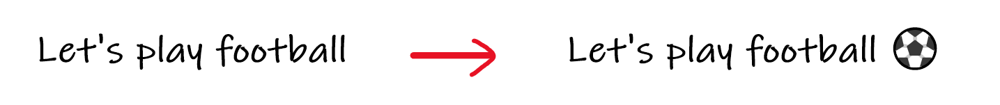

# Emogify 😞⚽😇 🍜❤️

<a href="https://tenor.com/view/face-with-medical-mask-people-joypixels-avoid-sickness-avoid-spreading-diseases-gif-17468910">Face With Medical Mask People GIF</a> from <a href="https://tenor.com/search/facewithmedicalmask-gifs">Facewithmedicalmask GIFs</a>

we have always struggled to make our text messages more expressive !! such as we text "Let's play football!" and search for the most appropriate emoji to this sentence.

So rather than searching the most appropriate emoji to your sentence "Let's play football"
this model can automatically turn this into "Let's play football⚽"
 

# Datasets 

<strong> Datasets</strong> consisting of different sentences along with the labels. Labels represent a particular emoji representing the sentence.😞⚽😇 🍜❤️
 
-test_emoji.csv - for testing our model with shape (315, 4)  
-train_emoji.csv - for training our model with shape (56, 2)  

Downloading Link-> [Datasets Link](https://www.kaggle.com/alvinrindra/emojify)
   
<strong> GloVe: Global Vectors for Word Representation </strong> 
-This Project contains English word vectors pre-trained on the combined Wikipedia 2014 + Gigaword 
  5th Edition corpora (6B tokens, 400K vocab). All tokens are in lowercase. This dataset 
 contains 50-dimensional, pre trained word vectors.  

Downloading Link-> [glove.6B.50D.txt](https://www.kaggle.com/watts2/glove6b50dtxt)

